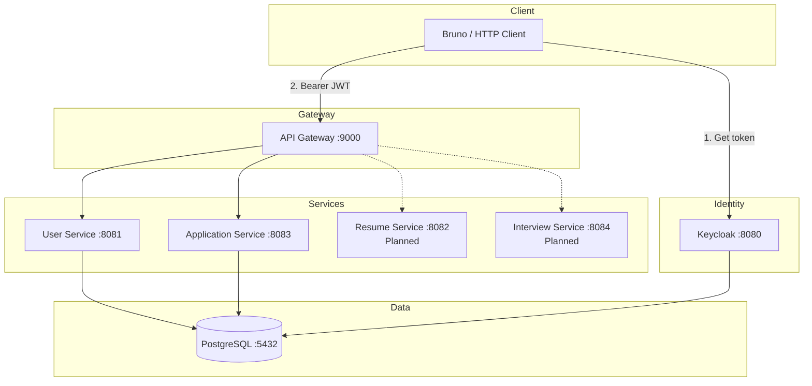
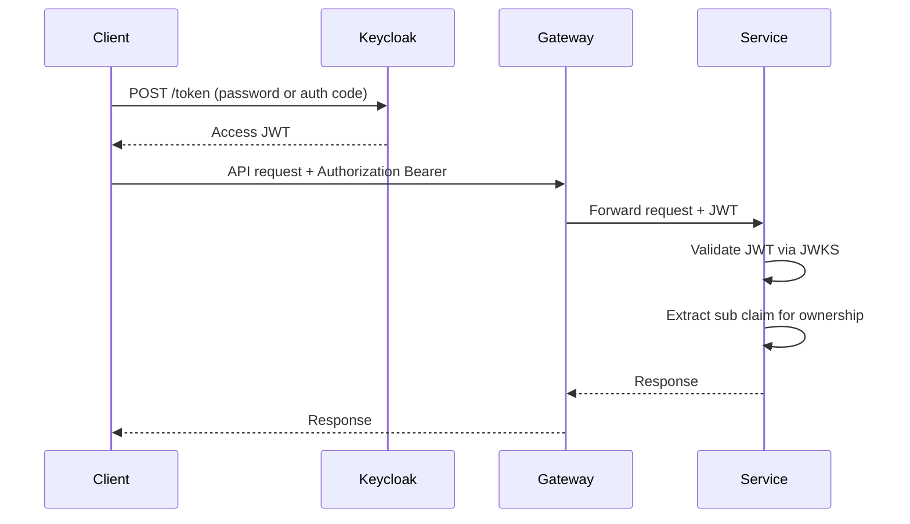

# CareerFlow

An **Identity-Aware Job Application Tracker** built with Spring Boot microservices, Keycloak, and PostgreSQL. CareerFlow demonstrates production-style backend patterns: OAuth2/OIDC, JWT-scoped data ownership, database-per-service, Flyway migrations, and API gateway routing.

---

## Motivation

Job searching involves tracking applications across many companies, statuses, referrals, and offers. CareerFlow provides a backend platform that:

- Authenticates users through a real identity provider (Keycloak)
- Scopes all data to the authenticated user via JWT subject
- Separates identity/profile data from application tracking data
- Exposes a consistent REST API through an API Gateway

This project is designed to be readable by senior engineers, hiring managers, and interviewers evaluating backend architecture skills.

---

## Architecture



**Request flow:** Client obtains a JWT from Keycloak → sends requests to the gateway with `Authorization: Bearer <token>` → gateway forwards to the appropriate service → service validates JWT locally and scopes data to `jwt.sub`.

See [docs/architecture.md](docs/architecture.md) for full system design.

---

## Technology Stack

| Layer | Technology |
|-------|------------|
| Language | Java 21 |
| Framework | Spring Boot 3.3, Spring Security 6, Spring Data JPA |
| Gateway | Spring Cloud Gateway |
| Identity | Keycloak 24 (OAuth2/OIDC) |
| Database | PostgreSQL 16 |
| Migrations | Flyway (application-service) |
| Build | Gradle 8.10 (multi-module) |
| API Testing | Bruno (OpenCollection) |
| Containers | Docker Compose |

---

## Repository Structure

```
CareerFlow/
├── README.md
├── backend/                          # Gradle monorepo
│   ├── shared-common/                # Correlation IDs, logging, shared exceptions
│   ├── api-gateway/                  # Port 9000 — routing only
│   ├── user-service/                 # Port 8081 — users & profiles
│   └── application-service/          # Port 8083 — applications, offers, activities
├── infrastructure/
│   ├── docker-compose.yml            # PostgreSQL + Keycloak
│   ├── postgres/init.sql             # Logical database bootstrap
│   └── keycloak/realm-export.json    # Realm, roles, demo users
├── bruno/                            # API test collection
├── frontend/                         # React SPA (Vite, port 5173)
└── docs/
    ├── project-status.md             # Current implementation status
    ├── architecture.md               # System architecture
    ├── api-overview.md               # Implemented API reference
    ├── api-contracts.md              # Removed — see api-overview.md
    ├── technical-debt.md             # Deferred work
    ├── roadmap.md                    # Future phases
    ├── setup-guide.md                # Infrastructure setup
    ├── local-development.md          # Dev workflow notes
    └── decisions/                    # Architecture Decision Records
```

---

## Features

### Implemented

- **Authentication** via Keycloak JWT access tokens
- **User Service:** sync user from JWT, read/update candidate profile
- **Application Service:**
  - Create and list job applications (with status/company filters and pagination)
  - View application details with offer and recent activities
  - Update application status with automatic activity logging
  - Upsert compensation offers
  - Activity timeline across all applications
  - Dashboard with aggregated metrics and response rate
- **Security:** JWT validation at each service; cross-user access returns 404
- **Flyway migrations** for application-service and user-service schema
- **Observability:** correlation IDs, structured logging, Prometheus metrics, health probes
- **Bruno collection** for manual API testing
- **Frontend (React SPA):** Keycloak login, dashboard, applications, profile — via API Gateway only

### Planned

- Resume Service, Interview Service
- Role-based method security (`@PreAuthorize`)
- Event-driven notifications (Kafka)
- CI/CD and cloud deployment

See [docs/project-status.md](docs/project-status.md) for details.

---

## Authentication Flow



Obtain a token with Bruno: **Auth → Get Candidate Token**, then paste the `access_token` into other requests.

---

## Running Locally

### Prerequisites

- JDK 21
- Node.js 20+ and npm
- Docker & Docker Compose v2

### 1. Start infrastructure

```bash
cd infrastructure
docker compose up -d
```

Verify:

- PostgreSQL: `localhost:5432` (user `postgres`, password `password`)
- Keycloak admin: `http://localhost:8080/admin` (`admin` / `admin`)

### 2. Start backend services

Open separate terminals:

```bash
cd backend

# Terminal 1 — API Gateway
./gradlew :api-gateway:bootRun

# Terminal 2 — User Service
./gradlew :user-service:bootRun

# Terminal 3 — Application Service
./gradlew :application-service:bootRun
```

| Service | Direct URL | Via Gateway |
|---------|------------|-------------|
| API Gateway | `http://localhost:9000` | — |
| User Service | `http://localhost:8081` | `http://localhost:9000/api/v1/users/**` |
| Application Service | `http://localhost:8083` | `http://localhost:9000/api/v1/applications/**` |

### 3. Run tests

```bash
cd backend
./gradlew :application-service:test :user-service:test
```

See [docs/setup-guide.md](docs/setup-guide.md) and [docs/local-development.md](docs/local-development.md) for additional setup notes.

### 4. Start the frontend

```bash
cd frontend
cp .env.example .env.development   # if not already present
npm install
npm run dev
```

| App | URL |
|-----|-----|
| Frontend | `http://localhost:5173` |
| API (via Vite proxy) | `http://localhost:5173/api/v1/**` → gateway `:9000` |

Demo login: `candidate@careerflow.com` / `password`

The frontend uses Keycloak Authorization Code + PKCE and sends all API requests through the gateway (never to individual services directly).

---

## Docker Setup

Docker Compose (`infrastructure/docker-compose.yml`) provides:

- **PostgreSQL 16** with init script creating logical databases
- **Keycloak 24.0.5** with realm auto-import

Databases: `careerflow_user`, `careerflow_application`, `careerflow_resume`, `careerflow_interview`, `keycloak_db`.

---

## Keycloak Setup

Realm: `careerflow-realm`

| Item | Value |
|------|-------|
| Token URL | `http://localhost:8080/realms/careerflow-realm/protocol/openid-connect/token` |
| JWKS URL | `http://localhost:8080/realms/careerflow-realm/protocol/openid-connect/certs` |
| OAuth client | `careerflow-api-gateway` |
| Demo candidate | `candidate@careerflow.com` / `password` |
| Roles | `CANDIDATE`, `ADMIN` |

---

## Flyway Migrations

Both business services use Flyway with `spring.jpa.hibernate.ddl-auto: validate`.

**Application Service** — `backend/application-service/src/main/resources/db/migration/`:

| Version | File | Creates |
|---------|------|---------|
| V1 | `V1__create_applications.sql` | `applications` table (with embedded referral columns) |
| V2 | `V2__create_offers.sql` | `offers` table |
| V3 | `V3__create_activities.sql` | `activities` table |

**User Service** — `backend/user-service/src/main/resources/db/migration/`:

| Version | File | Creates |
|---------|------|---------|
| V1 | `V1__create_users.sql` | `users` table |
| V2 | `V2__create_candidate_profiles.sql` | `candidate_profiles`, `candidate_skills` tables |

---

## API Gateway Routing

Configured in `backend/api-gateway/src/main/resources/application.yml`:

| Path prefix | Target | Status |
|-------------|--------|--------|
| `/api/v1/users/**` | `http://localhost:8081` | Implemented |
| `/api/v1/applications/**` | `http://localhost:8083` | Implemented |
| `/api/v1/resumes/**` | `http://localhost:8082` | Planned |
| `/api/v1/interviews/**` | `http://localhost:8084` | Planned |

The gateway does not validate JWTs; it forwards the `Authorization` header to downstream services.

---

## Bruno Usage

1. Open the `bruno/` folder in [Bruno](https://www.usebruno.com/).
2. Run **Auth → Get Candidate Token**.
3. Copy `access_token` into the bearer token field of other requests (or configure collection auth).
4. Test services directly (port 8081/8083) or through the gateway (port 9000).

Collection folders:

- **Auth** — Keycloak token requests
- **User Service** — profile endpoints
- **Application Service** — application lifecycle endpoints
- **Gateway** — routed requests through port 9000
- **Actuator** — health checks

---

## Current APIs

Quick reference (all require `Authorization: Bearer <JWT>`):

**User Service**

- `GET /api/v1/users/me`
- `GET /api/v1/users/me/profile`
- `PUT /api/v1/users/me/profile`

**Application Service**

- `POST /api/v1/applications`
- `GET /api/v1/applications`
- `GET /api/v1/applications/{id}`
- `PATCH /api/v1/applications/{id}/status`
- `PUT /api/v1/applications/{id}/offer`
- `GET /api/v1/applications/activities`
- `GET /api/v1/applications/dashboard`

Full schemas: [docs/api-overview.md](docs/api-overview.md)

---

## Screenshots

<!-- Placeholder: add UI screenshots here -->

The frontend provides a dashboard, application management, and candidate profile UI at `http://localhost:5173`.

---

## Documentation Index

| Document | Purpose |
|----------|---------|
| [project-status.md](docs/project-status.md) | What is built vs planned |
| [architecture.md](docs/architecture.md) | System design and security |
| [api-overview.md](docs/api-overview.md) | Implemented API reference |
| [technical-debt.md](docs/technical-debt.md) | Deferred improvements |
| [roadmap.md](docs/roadmap.md) | Future phases |
| [decisions/](docs/decisions/) | Architecture Decision Records |

---

## Future Roadmap

| Phase | Status | Focus |
|-------|--------|-------|
| Phase 1 | ✅ Complete | Identity & User Service |
| Phase 2 | ✅ Complete | Application Service |
| Phase 3 | ✅ Complete | Observability & production readiness |
| Phase 4 | Planned | Event-driven architecture |
| Phase 5 | Planned | Resume management |
| Phase 6 | Planned | Deployment & CI/CD |

Details: [docs/roadmap.md](docs/roadmap.md)

---

## License

Not specified.
