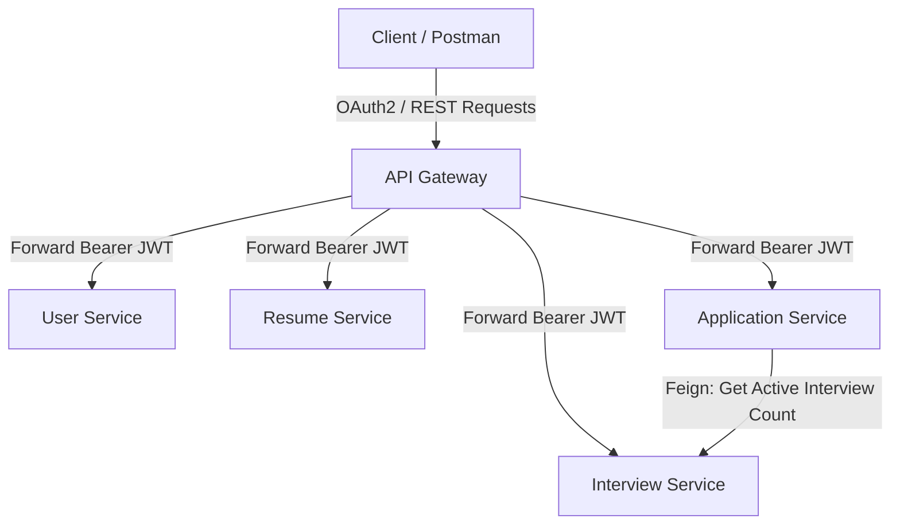
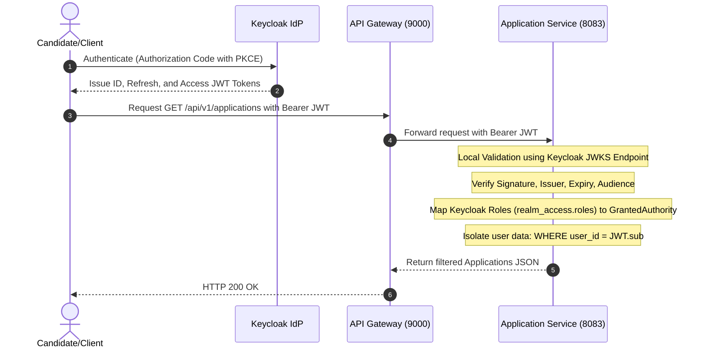

# CareerFlow Architecture & System Design

CareerFlow is a production-grade, Identity-Aware **Personal Career Operating System** designed for software engineers managing their job search. It serves as a candidate-centric platform that empowers individuals to track applications, manage referrals, organize resume versions, record post-interview retrospectives, and evaluate compensation offers, all protected by enterprise-grade OAuth2/OIDC/JWT security.

---

## 1. Technology Stack

* **Language**: Java 21 (LTS)
* **Framework**: Spring Boot 3.x, Spring Security 6.x, Spring Cloud Gateway, Spring Cloud OpenFeign
* **Identity Provider**: Keycloak 24+ (OAuth2, OpenID Connect, JWT, SSO)
* **Database**: PostgreSQL (Database-per-service pattern)
* **Containerization**: Docker & Docker Compose
* **Architecture Style**: Clean Architecture / Hexagonal Ports and Adapters

---

## 2. Microservice Boundaries & Responsibilities

The system is split into five logical services to ensure high cohesive focus, clear database isolation, and separation of concerns.



### 2.1 API Gateway (`api-gateway`)
- **Port**: `9000`
- **Responsibilities**:
  - Serves as the single entry point for all client requests.
  - Handles routing logic based on request path prefixes.
  - Performs stateless forwarding of incoming JWTs down to business microservices.

### 2.2 User Service (`user-service`)
- **Port**: `8081`
- **Database**: `cf_user`
- **Responsibilities**:
  - Manages candidate profile information (target roles, minimum/maximum target compensation, core skills).
  - Handles lightweight candidate user synchronization from Keycloak on initial authenticated request.

### 2.3 Resume Service (`resume-service`)
- **Port**: `8082`
- **Database**: `cf_resume`
- **Responsibilities**:
  - Acts as a dedicated resume repository tracking multiple resume versions.
  - Stores resume names, tailored descriptions, and metadata pointers to mock S3 paths.

### 2.4 Application Service (`application-service`)
- **Port**: `8083`
- **Database**: `cf_application`
- **Responsibilities**:
  - Tracks job applications (with URL and notes), referrals, compensation offers, and chronological career activity logs.
  - Aggregates and delivers the **Dashboard API** containing total applications, active interview counts, received offers, rejections, and state-by-state pipeline metrics.

### 2.5 Interview Service (`interview-service`)
- **Port**: `8084`
- **Database**: `cf_interview`
- **Responsibilities**:
  - Handles scheduling and management of specific interview rounds.
  - Stores candidate reflection retrospectives (what went well, challenges faced, confidence rating, retro notes).
  - Exposes internal Feign API to feed upcoming active interview counts back to the Application Service Dashboard.

---

## 3. Bounded Context Analysis (DDD)

We adopt Domain-Driven Design (DDD) to isolate our subdomains, establish clear Bounded Contexts, and outline Ubiquitous Languages.

### 3.1 Identity & Access Context (Keycloak)
- **Core Entities/Language**: Subject (sub), Client, Realm Role, Access Token.
- **Role**: Upstream (Provider) of security contexts and verified identity data.

### 3.2 Candidate Profile Context (User Service)
- **Core Entities/Language**: Candidate, TargetSalary, SkillTags, ProfileSync.
- **Role**: Downstream of Identity. Holds metadata related to the candidate's core professional details and career goals.

### 3.3 Resume Context (Resume Service)
- **Core Entities/Language**: ResumeVersion, VersionName, StorageReference, TailorNotes.
- **Role**: Keeps resume assets separate from the core profile so they can be versioned and attached individually to applications.

### 3.4 Job Application Context (Application Service)
- **Core Entities/Language**: JobApplication, ApplicationStatus, ReferralStatus, Offer, Compensations, ActivityLog, DashboardMetrics.
- **Role**: The central coordinator managing application states, compensation offers, referral logs, and overall pipeline analytics.

### 3.5 Interview & Retro Context (Interview Service)
- **Core Entities/Language**: InterviewRound, ReflectionRetro, Duration, PerformanceConfidence.
- **Role**: Downstream customer of Job Application Context. Job applications trigger rounds, which then collect candidate impressions and retrospectives.

---

## 4. PostgreSQL Schema Design

Each service owns its logical database to enforce strict isolation and decouple persistence.

```
+------------------------------------------------------------------+
|                         DATABASE SCHEMAS                         |
+------------------------------------------------------------------+
| cf_user        | cf_resume        | cf_application | cf_interview|
+----------------+------------------+----------------+-------------+
| users          | resume_versions  | job_apps       | interviews  |
| profiles       |                  | referrals      | retros      |
|                |                  | offers         |             |
|                |                  | activities     |             |
+----------------+------------------+----------------+-------------+
```

### 4.1 User Service (`cf_user` Schema)
```sql
CREATE TABLE users (
    id VARCHAR(36) PRIMARY KEY, -- Keycloak Key/UUID (JWT 'sub')
    email VARCHAR(255) UNIQUE NOT NULL,
    first_name VARCHAR(100),
    last_name VARCHAR(100),
    role VARCHAR(50) NOT NULL DEFAULT 'CANDIDATE',
    created_at TIMESTAMP NOT NULL DEFAULT CURRENT_TIMESTAMP,
    updated_at TIMESTAMP NOT NULL DEFAULT CURRENT_TIMESTAMP
);

CREATE TABLE candidate_profiles (
    user_id VARCHAR(36) PRIMARY KEY REFERENCES users(id) ON DELETE CASCADE,
    target_roles VARCHAR(255),          -- e.g., "Senior Software Engineer, Staff DevOps"
    target_salary_min DECIMAL(15, 2),
    target_salary_max DECIMAL(15, 2),
    skills TEXT[],                       -- Array of skill tags
    updated_at TIMESTAMP NOT NULL DEFAULT CURRENT_TIMESTAMP
);
```

### 4.2 Resume Service (`cf_resume` Schema)
```sql
CREATE TABLE resume_versions (
    id UUID PRIMARY KEY,
    user_id VARCHAR(36) NOT NULL, -- Isolated via JWT sub
    version_name VARCHAR(255) NOT NULL, -- e.g., "Staff-Stripe-Backend"
    resume_url VARCHAR(512) NOT NULL,    -- Mock S3 file reference
    tailor_notes TEXT,                   -- Tailoring details
    created_at TIMESTAMP NOT NULL DEFAULT CURRENT_TIMESTAMP,
    updated_at TIMESTAMP NOT NULL DEFAULT CURRENT_TIMESTAMP
);
```

### 4.3 Application Service (`cf_application` Schema)
```sql
CREATE TABLE job_applications (
    id UUID PRIMARY KEY,
    user_id VARCHAR(36) NOT NULL,
    company_name VARCHAR(255) NOT NULL,
    role_title VARCHAR(255) NOT NULL,
    job_url VARCHAR(512),
    company_notes TEXT,
    source VARCHAR(100) NOT NULL,       -- LINKEDIN, REFERRAL, COMPANY_WEBSITE, COLD_EMAIL
    status VARCHAR(50) NOT NULL,        -- WISHLIST, APPLIED, INTERVIEWING, OFFERED, REJECTED, ARCHIVED
    resume_id UUID,                     -- Reference to Resume version metadata ID
    created_at TIMESTAMP NOT NULL DEFAULT CURRENT_TIMESTAMP,
    updated_at TIMESTAMP NOT NULL DEFAULT CURRENT_TIMESTAMP
);

CREATE TABLE referrals (
    id UUID PRIMARY KEY,
    application_id UUID NOT NULL REFERENCES job_applications(id) ON DELETE CASCADE,
    referrer_name VARCHAR(255) NOT NULL,
    referrer_email VARCHAR(255),
    referrer_company VARCHAR(255),
    connection_type VARCHAR(100),       -- COWORKER, COLLEGE_ALUM, COLD_OUTREACH
    status VARCHAR(50) NOT NULL,        -- REQUESTED, SUBMITTED, REJECTED
    created_at TIMESTAMP NOT NULL DEFAULT CURRENT_TIMESTAMP
);

CREATE TABLE offers (
    id UUID PRIMARY KEY,
    application_id UUID NOT NULL UNIQUE REFERENCES job_applications(id) ON DELETE CASCADE,
    base_salary DECIMAL(15, 2) NOT NULL,
    equity_val_yearly DECIMAL(15, 2) DEFAULT 0.00,
    sign_on_bonus DECIMAL(15, 2) DEFAULT 0.00,
    performance_bonus_percent DECIMAL(5, 2) DEFAULT 0.00,
    currency VARCHAR(10) DEFAULT 'USD',
    status VARCHAR(50) NOT NULL,        -- PENDING, ACCEPTED, DECLINED
    expires_at TIMESTAMP,
    created_at TIMESTAMP NOT NULL DEFAULT CURRENT_TIMESTAMP
);

CREATE TABLE career_activities (
    id UUID PRIMARY KEY,
    user_id VARCHAR(36) NOT NULL,
    application_id UUID,
    activity_type VARCHAR(100) NOT NULL, -- STATUS_CHANGED, REFERRAL_UPDATED, OFFER_RECEIVED
    description TEXT NOT NULL,
    logged_at TIMESTAMP NOT NULL DEFAULT CURRENT_TIMESTAMP
);
```

### 4.4 Interview Service (`cf_interview` Schema)
```sql
CREATE TABLE interviews (
    id UUID PRIMARY KEY,
    application_id UUID NOT NULL, -- Logical link to Application Service job_applications
    user_id VARCHAR(36) NOT NULL,
    round_name VARCHAR(100) NOT NULL, -- e.g., "System Design", "Coding 1"
    scheduled_at TIMESTAMP NOT NULL,
    duration_minutes INT DEFAULT 45,
    interviewer_names VARCHAR(512),
    topics_covered TEXT,
    status VARCHAR(50) NOT NULL, -- SCHEDULED, COMPLETED, CANCELLED
    created_at TIMESTAMP NOT NULL DEFAULT CURRENT_TIMESTAMP
);

CREATE TABLE interview_retros (
    id UUID PRIMARY KEY,
    interview_id UUID NOT NULL UNIQUE REFERENCES interviews(id) ON DELETE CASCADE,
    what_went_well TEXT,
    challenges_faced TEXT,
    questions_asked TEXT,
    confidence_rating INT CHECK (confidence_rating BETWEEN 1 AND 5),
    created_at TIMESTAMP NOT NULL DEFAULT CURRENT_TIMESTAMP
);
```

---

## 5. Security, OAuth2, OIDC, and JWT Strategy

Security is standard-compliant, zero-trust, and built around OpenID Connect (OIDC) with Keycloak.



### 5.1 Local Cryptographic JWT Validation
Business services operate as OAuth2 Resource Servers. Instead of making synchronous introspection calls back to Keycloak for every incoming request, they download Keycloak’s public certificates once (and cache them) via the JSON Web Key Set (JWKS) endpoint:
`http://keycloak:8080/realms/careerflow-realm/protocol/openid-connect/certs`

This allows instant, cryptographically sound, offline validation of:
- **Signature Integrity**: Verified via Keycloak's public key (RS256).
- **Expiration Check (`exp`)**: Ensures token has not expired.
- **Issuer Verification (`iss`)**: Verifies token matches our configured realm url.
- **Client Audience Check (`aud`)**: Verifies target client audience details.

### 5.2 Custom Authority Mapping (RBAC)
Role-Based Access Control is enforced using Spring Security's Method Security annotations (`@PreAuthorize`).
Keycloak places client roles within the JSON path: `realm_access.roles`.
A custom `KeycloakRoleConverter` extracts these roles (e.g., `CANDIDATE`, `ADMIN`) and maps them as Spring Security Granted Authorities prefixed with `ROLE_` (e.g., `ROLE_CANDIDATE`).

### 5.3 Complete Data Isolation (Multi-Tenancy logic)
Since CareerFlow is a consumer app, complete data privacy is paramount.
1. The gateway routes the request.
2. The downstream service performs JWKS authentication.
3. Spring Controllers extract the authenticated user ID (`sub` claim) from the token.
4. Business logic strictly filters queries using this `sub` claim. Users can **never** access or edit records where `user_id != sub`, preventing IDOR (Insecure Direct Object Reference) vulnerabilities.
