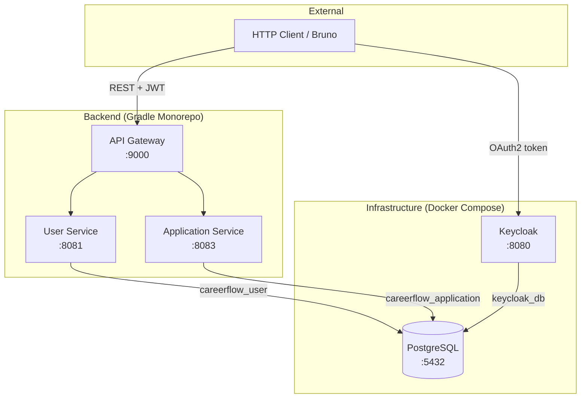
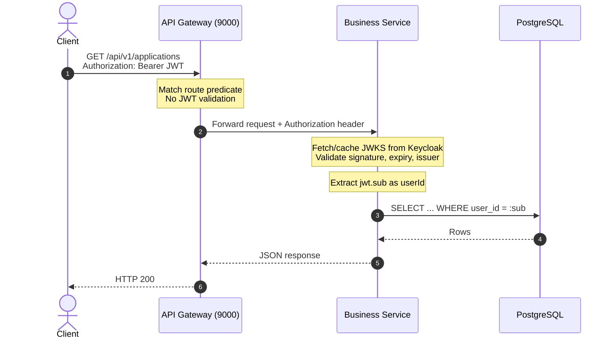
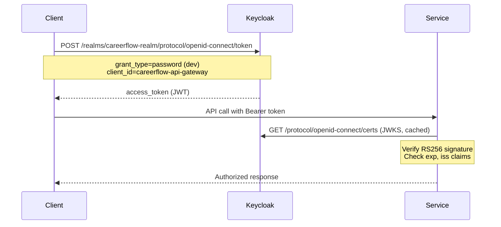
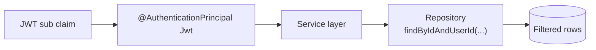

# CareerFlow Architecture

This document describes the **current implemented architecture** of CareerFlow. Planned services and features are explicitly marked.

---

## 1. System Overview

CareerFlow is a microservices-based backend for tracking job applications. It uses:

- **Keycloak** for identity and JWT issuance
- **Spring Cloud Gateway** as a single HTTP entry point
- **Independent Spring Boot services** with separate databases
- **Local JWT validation** at each service (OAuth2 Resource Server)



**Planned but not implemented:** Resume Service (`:8082`), Interview Service (`:8084`). Gateway routes for these paths exist; backends do not.

---

## 2. Service Boundaries

Each service owns a bounded context and its database. Services do not share tables or join across databases.

| Service | Responsibility | Does NOT own |
|---------|----------------|--------------|
| **User Service** | User records synced from Keycloak; candidate profiles (target roles, salary range, skills) | Job applications, offers, interviews |
| **Application Service** | Job applications, embedded referral info, offers, activity log, dashboard metrics | User email, name, profile details |
| **API Gateway** | Path-based routing, JWT passthrough | Business logic, authentication |

### Application Service internal structure

Feature-based packages (not layer-based):

```
application-service/
├── application/   web, service, repository, model, dto
├── offer/         web, service, repository, model, dto
├── activity/      web, service, repository, model, dto
└── shared/        security, exception, mapper
```

JPA entities do **not** use bidirectional relationships. `Offer` and `Activity` store `applicationId` and are loaded via separate repository queries.

---

## 3. Request Flow



### Correlation ID propagation (Phase 3)

Every request carries an `X-Request-ID` header:

1. **Gateway** generates a UUID if the client omits the header, forwards it downstream, and echoes it on the response.
2. **Business services** bind the value to SLF4J MDC (`requestId`) for structured logging.
3. **Error responses** include `requestId` in RFC 7807 `ProblemDetail` payloads.

See [ADR-007](./decisions/ADR-007-correlation-id-via-x-request-id.md).

### Gateway routing

| Route ID | Path | Upstream |
|----------|------|----------|
| user-service | `/api/v1/users/**` | `localhost:8081` |
| application-service | `/api/v1/applications/**` | `localhost:8083` |
| resume-service | `/api/v1/resumes/**` | `localhost:8082` (planned) |
| interview-service | `/api/v1/interviews/**` | `localhost:8084` (planned) |

---

## 4. Authentication Flow



### Token claims used

| Claim | Usage |
|-------|-------|
| `sub` | Primary user identifier; stored as `userId` in application-service |
| `email`, `given_name`, `family_name` | User sync in user-service (not stored in application-service) |
| `realm_access.roles` | Mapped to Spring authorities (`ROLE_CANDIDATE`, `ROLE_ADMIN`) |

---

## 5. JWT Validation

Each business service configures:

```yaml
spring:
  security:
    oauth2:
      resourceserver:
        jwt:
          jwk-set-uri: http://localhost:8080/realms/careerflow-realm/protocol/openid-connect/certs
```

Validation happens **locally** using Keycloak's public keys (JWKS). Services do not call Keycloak's token introspection endpoint on every request.

`SecurityConfig` in each service:

- Disables CSRF (stateless API)
- Permits `/actuator/health` and `/actuator/info` without auth
- Requires authentication for all other endpoints
- Registers `KeycloakRoleConverter` to map `realm_access.roles` to `GrantedAuthority`

**Note:** `@EnableMethodSecurity` is enabled, but controllers do not yet use `@PreAuthorize("hasRole('CANDIDATE')")`. Any valid JWT can call authenticated endpoints.

---

## 6. Ownership and Multi-Tenancy

CareerFlow is a single-user-per-account system. Data isolation is enforced by scoping every query to the JWT subject.



**Application Service rule:** If a resource exists but belongs to another user, return **404 Not Found** — not 403 Forbidden. This avoids leaking resource existence.

Clients must **never** send `userId` in request bodies. Ownership is derived exclusively from the JWT.

---

## 7. Database Ownership

Single PostgreSQL instance, multiple logical databases (database-per-service pattern):

```
PostgreSQL :5432
├── careerflow_user        → User Service
├── careerflow_application → Application Service (Flyway)
├── careerflow_resume      → Planned
├── careerflow_interview   → Planned
└── keycloak_db            → Keycloak
```

### User Service schema (Flyway-managed)

- `users` — id (Keycloak sub), email, name, role
- `candidate_profiles` — target roles, salary range, skills
- `candidate_skills` — element collection join table

Flyway migrations: `V1__create_users.sql`, `V2__create_candidate_profiles.sql`

### Application Service schema (Flyway-managed)

| Table | Purpose |
|-------|---------|
| `applications` | Job applications + embedded referral columns + `@Version` |
| `offers` | One offer per application (`application_id` UNIQUE) |
| `activities` | Audit trail; indexed by `user_id` and `application_id` |

---

## 8. Communication Between Services

**Current:** No synchronous inter-service calls are implemented.

- Application Service dashboard computes `activeInterviews` from application status (`INTERVIEWING`), not from Interview Service.
- No OpenFeign clients exist in the codebase.

**Planned:** Interview Service would expose an active interview count; Application Service would call it via Feign with forwarded JWT (see [technical-debt.md](./technical-debt.md)).

**Planned:** Event-driven communication via Kafka for domain events (Phase 4).

---

## 9. Design Rationale

### Why Keycloak?

- Production-grade OAuth2/OIDC without building custom auth
- JWKS-based JWT validation (standard, offline-capable)
- Realm roles, clients, and user federation out of the box
- Demonstrates real-world identity integration

### Why each service owns its database?

- **Loose coupling:** Services evolve schemas independently
- **Clear boundaries:** No shared-table anti-pattern
- **Security:** Application Service never stores PII it doesn't need
- **Scalability path:** Databases can be split to separate instances later

Trade-off: no cross-service JOINs; aggregation requires API calls or eventual consistency (events).

### Why Flyway?

- Version-controlled, reviewable schema changes
- Reproducible environments (dev, CI, prod)
- Both services use Flyway with Hibernate `ddl-auto: validate`

### Why JWT `sub` as ownership boundary?

- **Single source of truth** for identity (Keycloak)
- **Stateless services** — no session store
- **IDOR prevention** — every query filtered by authenticated subject
- **No trusted client input** — `userId` never accepted from request body

---

## 10. Error Handling

All services return RFC 7807 `ProblemDetail` responses via a shared `GlobalExceptionHandler` in `shared-common`:

| Condition | HTTP Status | `detail` |
|-----------|-------------|----------|
| Resource not found / wrong owner | 404 | Safe message (e.g. "Application not found") |
| Validation failure (`@Valid`) | 400 | Field-level validation summary |
| Missing/invalid JWT | 401 | Spring Security default |
| Unexpected server error | 500 | "An unexpected error occurred" (no stack traces) |

Every error includes `status`, `title`, `detail`, and `requestId` (from MDC).

The API Gateway uses a reactive `ErrorWebExceptionHandler` with the same shape.

---

## 11. Observability & Operations

| Capability | Implementation |
|------------|----------------|
| Correlation IDs | `X-Request-ID` header; MDC `requestId` |
| Access logging | Method, path, status, duration — no auth headers or bodies |
| Structured logging | JSON in `prod` profile; plain text in `dev` |
| Health probes | `/actuator/health/liveness`, `/actuator/health/readiness` |
| Metrics | `/actuator/prometheus` (Micrometer) |
| Configuration | Spring profiles (`dev`, `prod`); env-var overrides |

Shared module: `backend/shared-common/`

---

## 12. Testing Architecture

Application Service and User Service tests use:

- `@SpringBootTest` with `test` profile
- H2 in-memory database (`MODE=PostgreSQL`)
- Mock `JwtDecoder` for security tests
- `@AutoConfigureMockMvc` for HTTP-level ownership and error-format tests

Flyway is disabled in tests; Hibernate `create-drop` builds schema from entities.

| Module | Tests |
|--------|-------|
| application-service | 8 (repository, service, security) |
| user-service | 7 (repository, service, security) |

---

## 13. Related Documents

- [project-status.md](./project-status.md) — implementation checklist
- [api-overview.md](./api-overview.md) — endpoint reference
- [decisions/](./decisions/) — Architecture Decision Records
- [technical-debt.md](./technical-debt.md) — known gaps
