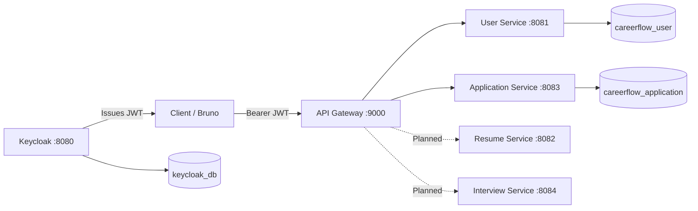

# CareerFlow Project Status

Last updated: June 2026 (post Phase 3)

---

## Project Vision

CareerFlow is an **Identity-Aware Job Application Tracker** built to demonstrate production-style backend engineering: OAuth2/OIDC authentication, microservice boundaries, database-per-service isolation, and secure multi-tenant data access.

The platform helps software engineers track job applications, referrals, offers, and career activity in one place—without storing identity data redundantly across services.

---

## High-Level Architecture



Clients authenticate with Keycloak, call the API Gateway with a JWT, and each downstream service validates the token locally before handling the request.

---

## Implementation Status Summary

| Area | Status |
|------|--------|
| Infrastructure (Docker Compose, PostgreSQL, Keycloak) | **Completed** |
| API Gateway (path routing) | **Completed** |
| User Service (profile + JWT sync) | **Completed** (with known gaps — see limitations) |
| Application Service (applications, offers, activities, dashboard) | **Completed** |
| Resume Service | **Planned** |
| Interview Service | **Planned** |
| Shared observability module | **Completed** |
| Frontend (React SPA) | **Completed** |
| CI/CD | **Planned** |
| Event-driven architecture (Kafka) | **Planned** |

---

## Completed Phases

### Phase 1 — Identity & User Service ✅

- Keycloak realm import (`careerflow-realm`)
- OAuth2 resource server configuration in user-service
- JWT validation via Keycloak JWKS endpoint
- Lazy user sync from JWT claims on first authenticated request
- Candidate profile CRUD scoped to authenticated user
- API Gateway route for `/api/v1/users/**`

### Phase 2 — Application Service ✅

- Gradle module with Flyway migrations (`V1`–`V3`)
- Feature-based package structure (`application`, `offer`, `activity`, `shared`)
- Full application lifecycle APIs (create, list, detail, status update)
- Offer upsert (`PUT /offer`)
- Activity timeline and automatic audit logging
- Dashboard with DB aggregation queries
- Ownership enforcement via JWT `sub` (404 on cross-user access)
- Integration tests (repository, service, security)
- Bruno API collection for application-service endpoints

### Phase 3 — Observability & Production Readiness ✅

- `shared-common` module: correlation IDs, access logging, shared exception handling
- `X-Request-ID` propagation through gateway and business services
- Profile-aware logging (plain text in `dev`, JSON in `prod`)
- RFC 7807 `ProblemDetail` errors with `requestId` across all services
- Liveness/readiness probes and Prometheus metrics
- Externalized configuration via Spring profiles and environment variables
- User Service Flyway migrations (`V1`–`V2`); `ddl-auto: validate`
- User Service tests (7 passing)
- Bruno collection updates (readiness, prometheus, inherited auth)
- ADR-007: Correlation ID propagation

**Deferred:** Shared security module extraction and `@PreAuthorize` (intentionally postponed).

### Phase 4 — Frontend MVP ✅

- React + TypeScript + Vite SPA in `frontend/`
- Keycloak Authorization Code + PKCE via `keycloak-js`
- All API calls through API Gateway (`:9000`) with Axios interceptors
- Dashboard with metrics, status chart, and activity feed
- Applications list (filters, pagination), create, detail, status update, offer management
- Candidate profile view and edit
- Gateway CORS for `http://localhost:5173`; Vite `/api` dev proxy
- TanStack Query, React Hook Form + Zod, shadcn/ui, Recharts, next-themes

---

## Service Responsibilities

| Service | Port | Database | Owns |
|---------|------|----------|------|
| **API Gateway** | 9000 | None | Routing only; forwards JWT unchanged |
| **User Service** | 8081 | `careerflow_user` | Users, candidate profiles |
| **Application Service** | 8083 | `careerflow_application` | Applications, offers, activities |
| **Resume Service** | 8082 (routed, not implemented) | `careerflow_resume` (planned) | Resume versions |
| **Interview Service** | 8084 (routed, not implemented) | `careerflow_interview` (planned) | Interview rounds, retros |

**Ownership rule:** Application Service stores only `userId` (JWT subject). It does not store email, username, or name.

---

## Current API Summary

All public APIs use the prefix `/api/v1`. Gateway entry point: `http://localhost:9000`.

### User Service — Implemented

| Method | Path | Description |
|--------|------|-------------|
| GET | `/api/v1/users/me` | Current user (synced from JWT) |
| GET | `/api/v1/users/me/profile` | Candidate profile |
| PUT | `/api/v1/users/me/profile` | Update candidate profile |

### Application Service — Implemented

| Method | Path | Description |
|--------|------|-------------|
| POST | `/api/v1/applications` | Create application |
| GET | `/api/v1/applications` | List applications (paginated, filterable) |
| GET | `/api/v1/applications/{id}` | Application detail + offer + recent activities |
| PATCH | `/api/v1/applications/{id}/status` | Update status + activity log |
| PUT | `/api/v1/applications/{id}/offer` | Create or replace offer |
| GET | `/api/v1/applications/activities` | User activity timeline |
| GET | `/api/v1/applications/dashboard` | Aggregated metrics |

See [api-overview.md](./api-overview.md) for request/response schemas.

### Resume & Interview Services — Planned

Gateway routes exist for `/api/v1/resumes/**` and `/api/v1/interviews/**`, but no backend modules are implemented.

---

## Infrastructure Components

| Component | Location | Notes |
|-----------|----------|-------|
| Docker Compose | `infrastructure/docker-compose.yml` | PostgreSQL 16 + Keycloak 24.0.5 |
| DB init script | `infrastructure/postgres/init.sql` | Creates 5 logical databases |
| Keycloak realm | `infrastructure/keycloak/realm-export.json` | Realm, roles, demo users, OAuth client |
| Gradle monorepo | `backend/` | Spring Boot 3.3, Java 21 |
| Bruno collection | `bruno/` | OpenCollection YAML requests |

**Databases created at startup:**

- `careerflow_user`
- `careerflow_resume`
- `careerflow_application`
- `careerflow_interview`
- `keycloak_db`

---

## Security Architecture

1. **Authentication:** Keycloak issues JWT access tokens (OAuth2/OIDC).
2. **Gateway:** Stateless path-based routing; does **not** validate JWTs.
3. **Services:** Each service is an OAuth2 resource server validating JWTs via Keycloak JWKS.
4. **Authorization:** All endpoints require authentication except actuator health/info.
5. **Ownership:** Business logic scopes queries to `jwt.getSubject()`. Cross-user resource access returns **404 Not Found** (application-service).
6. **Roles:** Keycloak `realm_access.roles` mapped to Spring authorities (`ROLE_CANDIDATE`, etc.). Method-level `@PreAuthorize` is enabled but **not yet applied** to controllers.

Demo credentials (Keycloak):

- Candidate: `candidate@careerflow.com` / `password`
- Admin: `admin@careerflow.com` / `password`
- OAuth client: `careerflow-api-gateway`

---

## Database Ownership

| Database | Schema management | Tables (current) |
|----------|-------------------|-------------------|
| `careerflow_user` | Flyway + Hibernate `validate` | `users`, `candidate_profiles`, `candidate_skills` |
| `careerflow_application` | Flyway + Hibernate `validate` | `applications`, `offers`, `activities` |
| `careerflow_resume` | Not implemented | — |
| `careerflow_interview` | Not implemented | — |

Application Service Flyway migrations:

- `V1__create_applications.sql`
- `V2__create_offers.sql`
- `V3__create_activities.sql`

User Service Flyway migrations:

- `V1__create_users.sql`
- `V2__create_candidate_profiles.sql`

Referral data is embedded in the `applications` table (not a separate `referrals` table).

---

## Testing Status

| Module | Tests | Status |
|--------|-------|--------|
| application-service | 8 tests (repository, service, security) | **Passing** (H2 in-memory, `test` profile) |
| user-service | 7 tests (repository, service, security) | **Passing** (H2 in-memory, `test` profile) |
| api-gateway | None | **Not implemented** |

Critical security tests: cross-user application access returns 404; unauthenticated user-service requests return 401.

Run tests:

```bash
cd backend && ./gradlew :application-service:test :user-service:test
```

---

## Technical Highlights

- **Java 21** and **Spring Boot 3.3** multi-module Gradle project
- **Database-per-service** with logical isolation on a shared PostgreSQL instance
- **Local JWT validation** (JWKS) — no per-request introspection calls to Keycloak
- **Flyway** versioned migrations in application-service and user-service
- **Optimistic locking** (`@Version`) on applications
- **Unidirectional JPA relationships** — offers and activities reference `applicationId` only
- **Dashboard aggregations** via repository count/GROUP BY queries (not in-memory)
- **Correlation IDs** (`X-Request-ID`) and structured logging via `shared-common`
- **Global exception handler** with RFC 7807 `ProblemDetail` responses (`shared-common`)
- **Prometheus metrics** and liveness/readiness probes
- **Bruno** OpenCollection for manual API testing

---

## Current Limitations

1. **Resume and Interview services** are routed by the gateway but not implemented.
2. **No `@PreAuthorize` role checks** on controllers despite Keycloak roles being mapped (deferred).
3. **Gateway does not validate JWTs** — invalid tokens fail at downstream services.
4. **No CI/CD pipeline**.
5. **No distributed tracing** (OpenTelemetry) — correlation IDs provide log-level tracing only.

---

## Known Technical Debt

See [technical-debt.md](./technical-debt.md) and [decisions/](./decisions/) for detailed tracking.

High-priority items for Phase 4+:

- Event-driven architecture (Kafka)
- `@PreAuthorize` role enforcement (when additional services justify shared security module)

---

## Planned Roadmap (Phase 4+)

See [roadmap.md](./roadmap.md) for the full plan.

| Phase | Focus |
|-------|-------|
| **Phase 4** | Event-driven architecture (Kafka, notifications) |
| **Phase 5** | Resume management service |
| **Phase 6** | Deployment (CI/CD, cloud, monitoring) |
